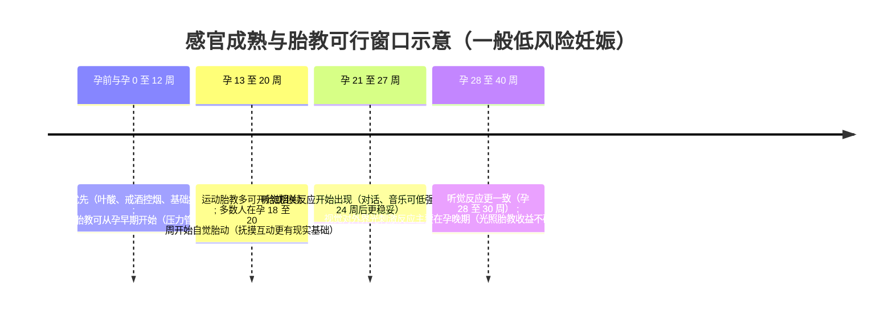

# 各类胎教类型的开始孕周、实施细节与证据支持综述

## 执行摘要

“胎教”在中文语境中通常指孕期通过营养、运动、情绪调适以及感官刺激等方式，改善母体与胎儿的宫内环境，并促进父母与胎儿的联结。现代循证医学对其可分成两条主线：其一是**标准产前保健**，包括营养、运动、心理健康与环境暴露管理，证据强、指南明确；其二是**以“教胎儿”为目的的刺激类胎教**，包括音乐、对话、抚摸、光照等，对“胎儿能否学习或记住刺激”有一定实验与神经生理证据，但对“提升智力、性格、长期神经发育获益”的直接证据总体不足，且存在商业化误用带来的潜在风险。

从“开始孕周”的证据导向看，最稳定、共识最高的结论是：

- **营养胎教**：应从**备孕期或尽早开始（孕前至少 1 至 3 个月）**，其中叶酸预防神经管缺陷的证据最强、推荐最明确。
- **运动胎教**：对无禁忌证的低风险妊娠，建议**贯穿孕期尽早开始或继续**；国际与国家级指南普遍建议每周累计至少 150 分钟中等强度活动，并明确了绝对禁忌证与相对禁忌证。
- **意念胎教**：可视作“心理胎教”或“情绪胎教”的核心部分，从**孕早期起**即应纳入常规产前保健，干预证据以降低孕期焦虑、抑郁与压力为主，部分综述提示对出生体重等结局可能有小幅影响，但结果并不一致。
- **抚摸胎教**：若限定为“腹部轻抚与互动”，更符合生理与体验基础的起点是**孕 16 至 20 周左右出现自觉胎动后**；主要证据指向增强孕期依恋、亲子联结与改善母体情绪，而非明确改善儿童长期结局。
- **对话胎教、音乐胎教**：应以胎儿听觉成熟为前提。研究综述提示胎儿对声音频率的初始反应大约在**孕 23 周左右**出现，更一致的反应多见于**孕 28 至 30 周**；职业与环境噪声过高可能带来风险，因此“低强度、不过度刺激”是关键。
- **光照胎教**：胎儿视觉系统对外界光刺激的可检测反应主要在**孕晚期**；研究显示胎儿眼动可对光刺激产生反应，且从**孕 26 周**起可观测到对“类人脸”图式的偏好，但这些研究并不等同于“家庭中用强光、闪光或激光进行胎教是有益且安全的”。整体证据等级最低，应格外谨慎。
- **美育胎教、自然胎教**：若将其定义为通过艺术与自然体验改善孕妇心理状态、睡眠与生活方式，则可从孕早期开始，其证据主要来自围产期心理健康干预与环境流行病学研究，例如居住绿度与不良妊娠结局风险降低的关联。

在实践层面，本报告给出的总体建议是：把胎教理解为“**以母体健康为中心的产前保健与亲子联结促进**”，优先级顺序为：**营养管理（含叶酸、碘、铁、钙等）与戒酒控烟** ＞ **规律运动** ＞ **心理健康与压力管理** ＞ **温和、被动的声音、触摸、自然、艺术体验** ＞ **避免光照等强刺激与任何商业化“强刺激设备”**。

## 定义与分类框架

在不引入超出证据的“智力开发”承诺前提下，本报告采用如下工作性定义：**胎教是一组在孕期实施的、以改善宫内环境与支持父母与胎儿联结为目的的非侵入性干预集合**。这一定义与“孕期依恋干预”或“亲子关系优化”的国际研究方向更一致：系统综述显示，触摸、胎动计数、音乐或哼唱、放松、冥想、呼吸、教育等方法可提高孕期依恋评分，但研究设计高度异质，头对头随机对照试验稀少。

### 本报告的证据分级口径

为满足“证据等级”要求，并便于跨类型比较，本报告将证据强度分为四档，并在总表中给出：

- **A（较强）**：多份权威指南或共识，加上系统综述、大型队列或多项随机对照试验，一致支持“对母体或妊娠结局有益且总体安全”。
- **B（中等）**：至少一份系统综述或多项随机对照试验支持某些短期结局，多为焦虑、抑郁、胎儿心率短期变化、依恋评分，但异质性大或长期结局不清。
- **C（有限）**：以小样本试验、观察研究或机制研究为主，结局多为间接指标，缺乏临床重要结局，或可重复性一般。
- **D（很低或证据稀缺）**：主要为理论推断、描述性研究，或证据不足，不建议作为“必须做的胎教”。

## 胎儿发育时间窗与安全阈值

胎教“开始孕周”之所以差异巨大，核心原因在于不同干预依赖的胎儿感官与神经系统成熟度不同，而临床上更应以**成熟窗口加安全阈值**来确定“何时开始、做多强”。

### 听觉相关窗口与噪声风险

证据较一致的结论是：胎儿对声音频率变化的初始反应大约在**孕 23 周**出现，更一致的反应多见于**孕 28 至 30 周**；不同研究的刺激方式、强度、频率与暴露时长差异很大，因此很难推导“最佳起始周与最佳剂量”。

职业与环境噪声方面，职业噪声暴露与后代听力问题之间的证据并非完全一致，但有全国队列研究提示关联，且公共机构提醒“非常响的噪声可能损伤胎儿听力”，胎儿耳部发育与开始对声音反应的时间点也大致落在**孕 20 周左右开始发育、孕 24 周左右开始反应**这一范围。

此外，近期对“子宫内外声传播”的建模与计算提示：母体腹部与骨盆对部分频段的衰减可能并不大，这意味着“把声源贴在腹部、音量开大”的做法并不能因为“隔着肚皮”就被视为安全。

### 视觉相关窗口与光刺激的局限

可在超声下观察到胎儿眼动的时间可早至孕中期，但“可被外界光刺激引发的定向视觉反应或注意”主要见于孕晚期。研究中使用特定波长与功率的光刺激，甚至包含激光点阵，可以诱发胎儿头动与眼动，这证明了“胎儿在子宫内具备一定视觉反应能力”，但并不等价于“家庭自制光照胎教是有效且无风险”。

更近期研究显示：从**孕 26 周**起，可检测到胎儿对“类人脸”图式的偏好，且这种反应随孕周推进而增强；这更适合被解释为“视觉系统成熟的研究证据”，而非“家庭干预指南”。

### 触觉与“胎动出现”作为抚摸互动的现实起点

临床与孕妇体验层面，“开始感到胎动”常见在**孕 18 至 20 周左右**，经产妇可能更早，约孕 16 周，初产妇可能更晚，超过孕 20 周。这为“抚摸胎教”提供了现实的互动锚点：孕妇能区分“胎儿活动、抚摸、再活动”的反馈循环。

## 各类胎教的实施与证据综述

以下按原报告覆盖并定义：营养胎教、音乐胎教、美育胎教、抚摸胎教、对话胎教、光照胎教、运动胎教、意念胎教、自然胎教；并在相关处补充常见衍生分类，例如“情绪胎教”“心理胎教”“环境胎教”“阅读胎教”，以避免重复。详细内容已拆分至对应专题文件。

## 综合对比表与时间线图示

### 各类型开始孕周、证据强度、要点与风险对照表

| 胎教类型 | 推荐开始孕周（区间或理由） | 证据强度（A 至 D） | 主要实施要点（可执行） | 主要风险与控制点 |
|---|---|---|---|---|
| 营养胎教 | 备孕期起，孕前至少 1 至 3 个月；叶酸需在孕早期前完成关键窗口 | A | 叶酸按指南剂量与时长；分层补铁、补碘、补钙；不饮酒 | 补充剂叠加过量；甲状腺疾病等需医嘱；把“补品”当医疗替代 |
| 运动胎教 | 孕早期即可开始或继续，无禁忌证时更适宜 | A | 每周不少于 150 分钟中等强度活动；每周至少 3 天；可加抗阻与拉伸；仰卧不适则调整 | 有明确绝对禁忌证与相对禁忌证；跌倒、过热、脱水、低血糖 |
| 意念胎教 | 孕早期起，并与产前心理筛查同步 | B | 每日 10 至 20 分钟正念、放松或呼吸训练；可用结构化课程；必要时转介治疗 | 以自助替代就医；重症需专业处理；避免诱发过度换气等不适 |
| 抚摸胎教 | 胎动出现后更合适，常见为孕 16 至 20 周起 | C | 轻抚回应胎动；每次 5 至 10 分钟，每天 1 至 2 次；不追求“刺激” | 避免按压与拍打；并发症、出血、宫缩风险时应停止 |
| 对话胎教 | 孕 24 周后更稳妥；反应更一致多见于孕 28 至 30 周 | C | 日常对话、朗读、哼唱；短时、低音量；不贴腹耳机 | 噪声过强可能有风险；商业化“教学式刺激”误用 |
| 音乐胎教 | 孕 24 周后更稳妥；更成熟窗口为孕 28 至 30 周 | B | 常见研究剂量为每天 20 至 60 分钟，连续数天至数周；以减压为目标 | 避免高音量、低频强刺激；不贴腹耳机；噪声职业暴露需防护 |
| 光照胎教 | 孕晚期；研究显示孕 26 周起可观测视觉偏好，孕 31 周后反应更成熟 | D | 优先做昼夜光环境卫生；如照腹则极短时柔光，不用闪光或激光 | 强光、发热、闪烁、激光风险；收益不确定，误用风险高 |
| 美育胎教 | 孕早期至全孕期均可 | B | 轻量艺术活动每次 20 至 60 分钟、每周数次；可采用团体支持；目标是情绪调节 | 材料化学暴露与疲劳；以活动替代专业治疗的风险 |
| 自然胎教 | 孕早期起，备孕期更好 | B | 绿地步行，可与运动胎教合并；减少污染与噪声暴露 | 污染、高温、跌倒、感染；把相关性误当因果 |

### 孕周—干预窗口时间线示意（证据导向）

## 风险管理与实践建议

将胎教放入“产前保健风险控制”的框架里，比把胎教当作“特殊训练课程”更安全，也更符合证据。世界卫生组织的产前保健指南强调：产前照护应覆盖营养、评估、预防与健康教育，本质上与广义胎教高度重合。

在“无特定健康限制或未指定”的条件下，建议遵循三条总原则：

第一，**先做高证据、低争议的项目**：叶酸与关键营养素管理、戒酒、规律运动、心理健康筛查与干预。

第二，**刺激类胎教坚持“低强度、短时间、可中断、以孕妇舒适为准”**：对话与音乐以“情绪放松与亲子联结”为目标，避免贴腹耳机与高音量；抚摸以轻抚回应胎动为主，避免“敲打唤醒”；光照不建议作为常规胎教项目。

第三，**对风险分层与高危管理保持敏感**：国家层面推动妊娠风险筛查与分级管理，任何“胎教计划”都应服从于高危管理与产科医嘱。

## 证据缺口与研究展望

刺激类胎教，包括音乐、对话、光照，在研究上面临共同瓶颈：干预剂量差异巨大、音量与频谱常不规范、暴露途径不同，环境播放与贴腹设备差异明显，结局指标又从胎儿心率、新生儿事件相关电位一直跨到儿童长期神经发育，导致“可重复、可转化为家庭指南”的证据难以形成。既有研究仍无法确定最佳开始时间与安全剂量，商业化误读还会诱导潜在有害实践。

同样，音乐减压的证据虽较好，但系统综述与荟萃分析也提示研究异质性高，音乐参数与总暴露时长报告不完整，临床意义与最佳方案仍需标准化。

依恋促进类胎教，例如抚摸、胎动计数、教育、放松，显示出更一致的孕期依恋改善信号，但系统综述强调头对头随机对照试验稀少、研究设计多样，仍需要更高质量比较研究来指导临床与公共卫生推广。

环境胎教与自然胎教，例如绿地暴露，虽有大样本系统综述与荟萃分析支持其与更好出生结局相关，但作者与后续研究普遍提醒残余混杂与居住选择偏倚，未来需要更精细的暴露测量与准实验设计来增强因果推断。
